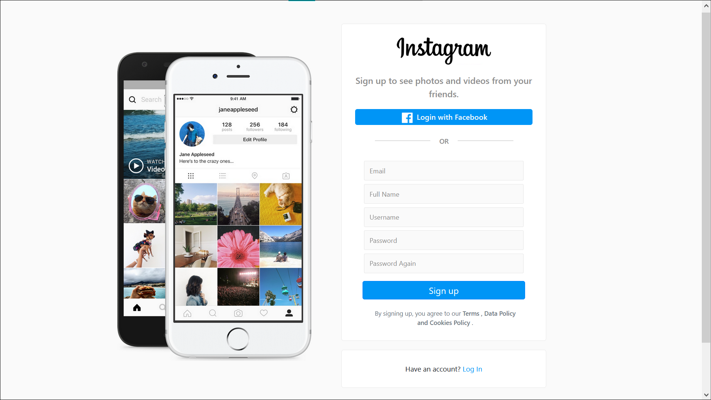
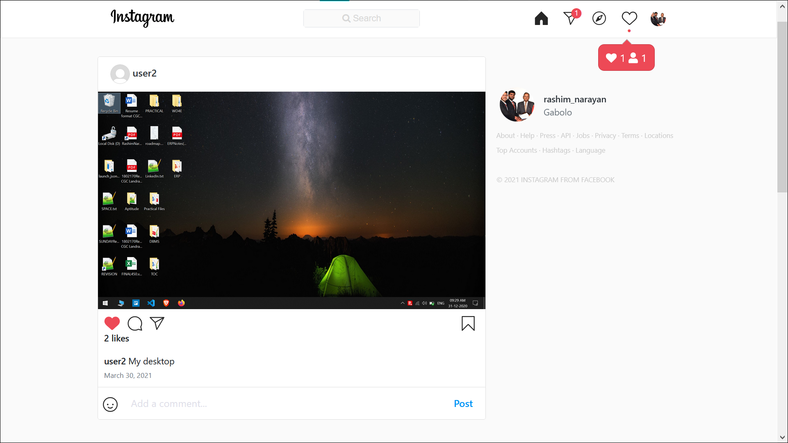
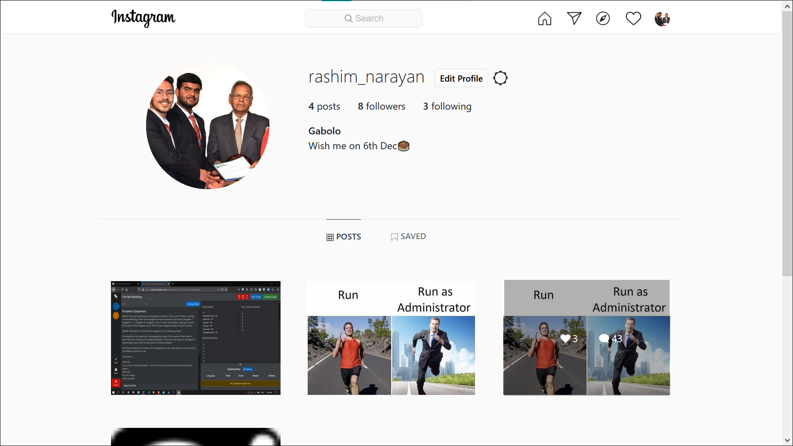
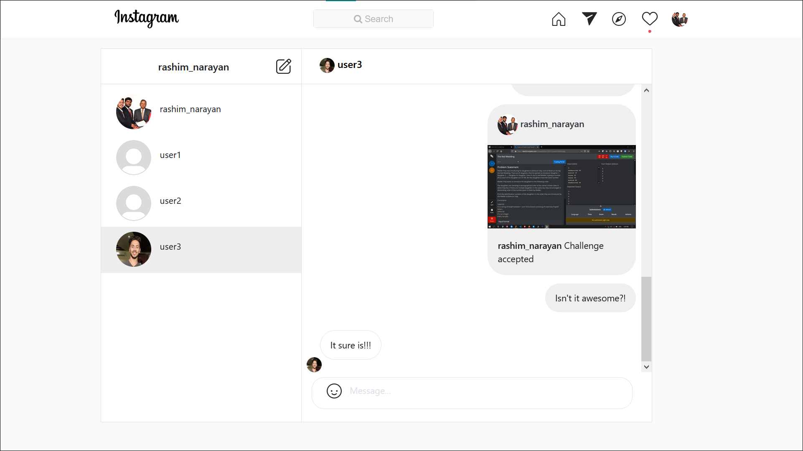

# Instagram
It is a fully functional and responsive Instagram web clone made in Django.

The frontend is made with HTML, CSS/Bootstrap and JS/Jquery

## Features

### *Profile*
* Login/Signup page
* Facebook Authentication
* Profile page
* Saved Post Page
* Edit Profile
* Password change
* E-mail Password Reset

### *Instagram Feeds*
* Infinite scrolling posts
* Add New Posts
* Profile Search
* Single Post Page
* Dynamic Like and Save posts
* Comments and reply to comments
* Share post to others
* Explore Page

### *Message System*
* Messages Page
* Search people to message
* Send/Recieve messages in real-time
* Message Notification counter on top

### *Notification System*
* Real-time Message Notification
* Notification Panel and Popup notification for Like, Comment and follow.

## Images
### Signup Page

### Home Page

### Profile Page

### Messages Page

## Credit
Almost every logo/Image (except profile pictures and posts) are the property of Facebook, Inc. and I am in no way intenting to call it as my own.

### *Imitation is the highest form of Flattery*
