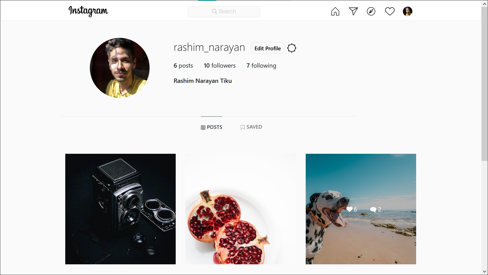

# Instagram
It is a fully functional Instagram web clone made in Django (In progress).

The frontend is made with Bootstrap, JS, CSS, HTML.

## Images
### Signup Page

### Home Page

### Profile Page

### Messages Page

## Backend Stuff Done:

*Profile*
* Login/Signup page
* Basic user profile page
* Edit profile
* Password change
* Saved Post Page

*Instagram Feeds*
* Profile Search
* Infinite scrolling posts
* Single Post Page
* Dynamic Like, Comment, Save 
* Share post in Messages
* Explore Page

*Message System*
* Inbox Page
* Create new inboxes
* Dynamic messages send/recieve

*Notification System*
* Dynamic message notification
* Like, Comment, follow notification

## Frontend Stuff Done:

* *Navigation-bar*
* *Notification Panel*
* *Single Post View*
* *Main/Post Page*
* *Messages Page*
* *Profile Page*
* *Explore Page*
* *Login Page*
* *Signup Page*
